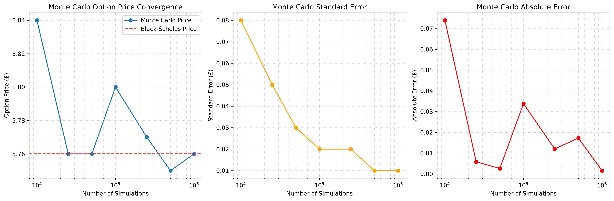
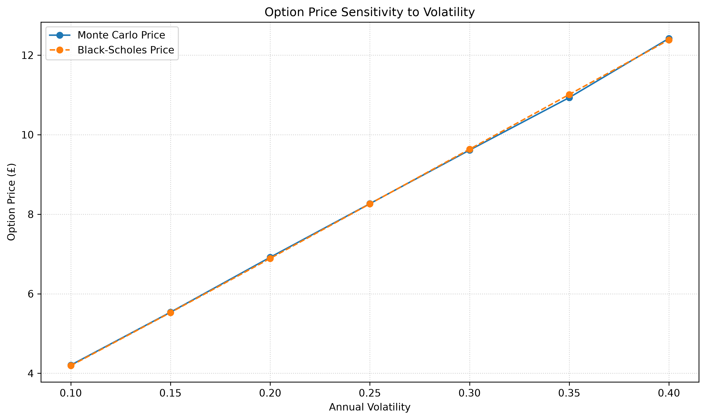

# Monte Carlo Options Pricing Engine
A Python implementation of Monte Carlo pricing for European call options under the Black-Scholes framework.
The project simulates stock price using **Geometric Brownian Motion (GBM)**, prices European call options using Monte Carlo simulation, and validates the results against the **Black-Scholes** solution. It also investigates convergence, statistical error, computational performance, and sensitivity to volatility.

## Overview
This project implements a Monte Carlo pricing engine for an European call option and analyses how the accuracy of the estimated option value changes with the number of simulations.
The project also compares the Monte Carlo result with the Black-Scholes price to validate the implementation.

## Mathematical Model

### Geometric Brownian Motion
The stock price is modelled using Geometric Brownian Motion:

$$S_{t+\Delta t} = S_t \exp\left[ \left(r - \frac{1}{2}\sigma^2\right)\Delta t + \sigma\sqrt{\Delta t}Z \right]$$

where:

* \(S_t\) = stock price at time \(t\)
* \(r\) = risk-free interest rate
* \(sigma\) = annual volatility
* \(Delta t\) = simulation time step
* \(Z\) = standard normal random variable

The simulation uses the risk-neutral drift required for derivative pricing.

### European Call Payoff

For a European call option, the payoff at maturity is:

$$
\max(S_T-K,0)
$$

where:

* \(S_T\) = stock price at expiration
* \(K\) = strike price

### Monte Carlo Pricing

The option value is estimated from the discounted average simulated payoff:

$$
C \approx e^{-rT}\frac{1}{N}
\sum_{i=1}^{N}\max(S_T^{(i)}-K,0)
$$

where \(N\) is the number of Monte Carlo simulations.

### Black-Scholes Benchmark

The Monte Carlo estimate is compared against the Black-Scholes European call price:

$$C = S N(d_1) - K e^{-rT} N(d_2)$$

with

$$
d_1 =
\frac{
\ln(S/K)+(r+\sigma^2/2)T
}{
\sigma\sqrt{T}
}
$$

and

$$
d_2=d_1-\sigma\sqrt{T}
$$

This provides an benchmark for validating the Monte Carlo implementation.

## Convergence Analysis
The pricing engine was tested using between 10,000 and 1,000,000 simulations.
As the number of simulations increases, the standard error decreases and the Monte Carlo estimate becomes more precise.



The Monte Carlo estimate does not need to move monotonically towards the Black-Scholes price because each simulation produces a random estimate. However, the uncertainty of the estimate decreases as the number of simulations increases.
For 1,000,000 simulations, the Monte Carlo estimate was approximately **£5.76**, compared with a Black-Scholes value of approximately **£5.76**.
The implementation also calculates a 95% confidence interval using the Monte Carlo standard error.

## Volatility Sensitivity
The pricing engine was also evaluated across different levels of annual volatility.



The results demonstrate the expected relationship between volatility and the value of a European call option: higher volatility generally increases the option's value because the upside potential increases while the downside is limited to the option premium.
The Monte Carlo estimates are compared directly with the corresponding Black-Scholes prices.

## Computational Performance
The project also compares different approaches to Monte Carlo simulation.
A Python loop implementation was compared with NumPy-vectorised simulation.
Vectorisation significantly reduces computation time by performing numerical operations on entire arrays rather than iterating through individual simulations in Python.

For example, simulating 10,000 complete paths took approximately:

| Method              |      Time |
| ------------------- | --------: |
| Python loop         |   ~3.83 s |
| NumPy vectorisation | ~0.0012 s |

The project also uses a terminal-price-only simulation for European options. Since the payoff depends only on \(S_T\), it is unnecessary to store the complete path for every simulation.

This provides a substantial reduction in memory usage and computational work.

## Statistical Analysis
The Monte Carlo pricing engine calculates:

* Monte Carlo option value
* Standard error
* 95% confidence interval
* Absolute difference from the Black-Scholes benchmark

The standard error is calculated as:

$$
SE =
e^{-rT}
\frac{s}{\sqrt{N}}
$$

where \(s\) is the sample standard deviation of the simulated payoffs.

The expected Monte Carlo convergence behaviour is consistent with the standard relationship:

$$
SE \propto \frac{1}{\sqrt{N}}
$$

## Testing
The project includes automated tests using `pytest`.

The tests cover:

* European call payoff calculations
* Black-Scholes pricing
* Black-Scholes sensitivity to volatility
* Stock-price simulation
* GBM path generation
* Terminal-price simulation
* Monte Carlo payoff generation
* Monte Carlo price validation against the Black-Scholes benchmark

The current test suite contains **13 tests**.

Run the tests with:

```bash
python -m pytest
```

### Main Components

**`StockSimulation.py`**

Implements Geometric Brownian Motion and provides methods for:

* individual stock-price steps
* individual simulated paths
* vectorised full-path simulation
* vectorised terminal-price simulation

**`option.py`**

Defines the European call option and its payoff function.

**`monte_carlo.py`**

Contains the Monte Carlo pricing engine, including discounting, standard error and confidence interval calculations.

**`BlackScholes.py`**

Provides the Black-Scholes benchmark.

**`convergence_analysis.py`**

Analyses the relationship between number of simulations, Monte Carlo price, standard error and absolute error.

**`sensitivity_analysis.py`**

Investigates how the option price changes as annual volatility changes.

**`main.py`**

Runs the main pricing example and displays the Monte Carlo result alongside the Black-Scholes benchmark.

## Key Skills Demonstrated

* Python
* Object-oriented programming
* NumPy vectorisation
* Monte Carlo simulation
* Geometric Brownian Motion
* Numerical methods
* Probability and statistics
* Black-Scholes option pricing
* Statistical error analysis
* Computational performance optimisation
* Automated testing with pytest
* Git and GitHub

## Future Improvements

Potential extensions to the project include:

* pricing additional option types
* path-dependent options such as Asian options
* variance-reduction techniques
* additional Greeks estimation
* more extensive performance benchmarking
* alternative stochastic models
